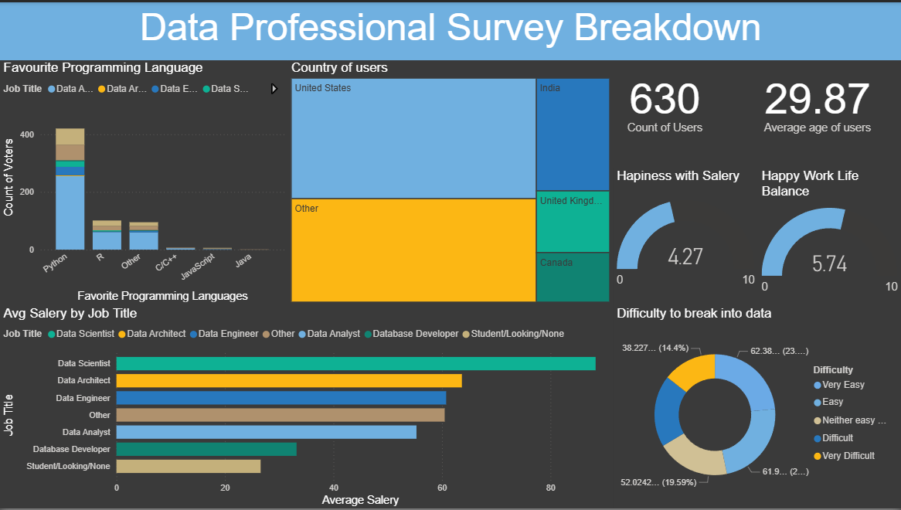

# 📊 Data Professional Survey Breakdown  

An interactive Power BI dashboard analyzing insights from a Kaggle survey of data professionals—covering demographics, salaries, job roles, tools, and work-life balance.  

---

## 🔎 Purpose  

The dashboard helps visualize the landscape of data-related careers by exploring:  
- Salary distribution by job title  
- Most popular programming languages  
- Geographic distribution of users  
- Work-life balance and job satisfaction  
- Difficulty of breaking into data careers  

---

## 🛠 Tech Stack  

- **Power BI Desktop** → Data visualization & reporting  
- **Power Query** → Data cleaning & transformation  
- **DAX (Data Analysis Expressions)** → Calculated measures & KPIs  
- **Dataset** → Kaggle’s Data Professional Survey  

---

## 📂 Data Source  

- **Source**: Kaggle Data Professional Survey  
- **Dataset includes**:  
  - Demographics (age, country, job role)  
  - Programming languages used  
  - Average salaries by job title  
  - Work-life balance, job satisfaction  
  - Entry difficulty into data roles  

---

## 🌟 Features & Highlights  

### Business Problem  
Data professionals are in high demand, but understanding their backgrounds, salaries, and challenges is often fragmented across surveys.  

### Goal of the Dashboard  
To create a comprehensive, interactive tool that summarizes the state of data careers—helping students, professionals, and organizations understand trends in this field.  

### Walkthrough of Key Visuals  
- **Favorite Programming Languages** → Python dominates, followed by R and others.  
- **Country of Users** → Majority from the US and India, with representation from the UK, Canada, and others.  
- **Key KPIs** →  
  - Count of Users: **630**  
  - Average Age: **29.87 years**  
  - Happiness with Salary: **4.27 / 10**  
  - Work-Life Balance: **5.74 / 10**  
- **Average Salary by Job Title** → Data Scientists & Data Architects earn the most.  
- **Difficulty of Entering Data Roles** → Split across “Easy,” “Neither,” and “Difficult.”  

### Business Impact & Insights  
- **Career Guidance** → Helps newcomers identify skills in demand (Python, SQL, R).  
- **Salary Benchmarking** → Shows realistic pay expectations by role.  
- **Regional Analysis** → Identifies top countries for data careers.  
- **Workplace Trends** → Highlights areas needing improvement (salary satisfaction, work-life balance).  

---

## 📸 Dashboard Preview  

  

---

## 🚀 How to Use  

1. Open the `.pbix` file in **Power BI Desktop**.  
2. Explore filters and slicers to analyze different job roles, countries, and metrics.  
3. Use insights for research, career planning, or organizational benchmarking.  
